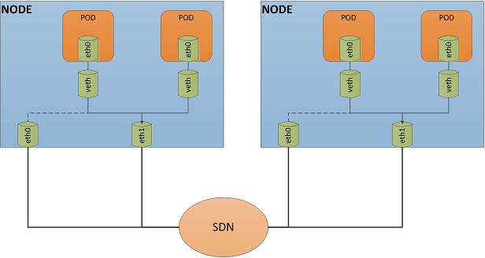

# CNI-Plugin

[Container Network Interface](https://github.com/containernetworking/cni)是一项开源项目，旨在为运行在Linux上的容器网络构建提供统一的接口和开发库。Kubernetes项目使用CNI插件为Pod构建网络。本文章介绍了京东云JKE项目中，CNI插件的实现方法和细节。

## Kubernetes网络模型

- IP-per-Pod，每个 Pod 都拥有一个独立 IP 地址，Pod 内所有容器共享一个网络命名空间
- 集群内所有 Pod 都在一个直接连通的网络中，可通过 IP 直接访问
  - 所有容器之间无需 NAT 就可以直接互相访问
  - 所有 Node 和所有容器之间无需 NAT 就可以直接互相访问
  - 容器自己看到的 IP 跟其他容器看到的一样
- Service cluster IP 只可在集群内部访问，外部请求需要通过 NodePort、LoadBalance 或者 Ingress 来访问

## 实现原理

- 每个node节点都可以挂载多块弹性网卡，每块弹性网卡上可以申请多个从IP。
- 每个pod分配一个空闲从IP，作为其IP地址。通过此IP地址，可以实现：
  - 同节点上，Pod到Pod的通信
  - 不同节点上，Pod到Pod的通信
  - Pod到node的通信
  - Pod访问内部service
  - pod出公网的通信

同一个K8s集群中，所有Node节点所挂载的所有弹性网卡，处于同一个子网和相同的安全组内。当弹性网卡挂载到虚机实例上时，只有弹性网卡的主IP分配并配置到了网卡上，所有的从IP保持未分配状态。然后再由IPAM负责申请从IP，加入到IP地址池中。

## CNI网络配置



### 创建Veth-pair并加入到pod netns中

每个Pod拥有一个独立的[网络名字空间](http://man7.org/linux/man-pages/man7/network_namespaces.7.html)。在default网络名字空间中创建一对[Veth](https://docs.jdcloud.com/cn/elastic-network-interface/restrictions)，将pair的一端加入到pod的名字空间中，另一端留在default名字空间中。

```plain
 ip netns add ns1
 ip link add veth1 type veth peer name veth1c
 ip link set veth1c netns ns1
```

### pod内的配置

#### 给网卡配置ip地址

```plain
 ip netns exec ns1 ip link set veth1c name eth0
 ip netns exec ns1 ip link set eth0 up
 ip netns exec ns1 ip addr add 192.168.0.3/32 dev eth0
 ip netns exec ns1 ip link set eth0 mtu 1450
```

#### 配置默认路由和静态arp

```plain
 ip netns exec ns1 ip route add 169.254.1.1 dev eth0
 ip netns exec ns1 ip route add default via 169.254.1.1 dev eth0
 ip netns exec ns1 arp -i eth0 -s 169.254.1.1 <mac-of-veth1>

 note: 169.254.1.1 is a fake gw
```

### host端的配置

#### 网卡up

```plain
 ip link set veth1 up
```

#### 配置策略路由

```plain
 ip rule to 192.168.0.3 table main pri 512  // to pod
 ip rule from 192.168.0.3 table 100 pri 1536 // from pod

 note:
 1 所有的（to pod）都在prio 512，所有的（from pod）都在prio 1536
 1（to pod） 的规则必须优先于（from pod）的规则
```

#### 修改100表

```plain
 ip route add 192.168.0.0/24 dev eth1 table 100
 ip route add default via 192.168.0.1 table 100
```

#### 修改main表

```plain
 ip route add 192.168.0.3/32 dev veth1 table main
```

## 包转发路径

### pods on same host

node1.pod1(192.168.0.3)--> node1.pod2(192.168.0.4)

ip netns exec ns1 ping 192.168.0.4

```plain
 sip: 192.168.0.3
 dip: 192.168.0.4
```

#### inside-pod route loockup

```plain
 look up for route: default via 169.254.1.1 dev veth1c
 look up forarp arp: -s 169.254.1.1 <mac-of-veth1>
 mac: veth1c --->veth1
```

#### host-side route lookup through table main

```plain
 veth1 receive the pacage send from veth1c
 look up rule: to 192.168.0.4 table main pri 100
 look up route: dst 192.168.0.4/32 dev veth2
 mac: veth2--->veth2c
 veth2c receive
```

### pods on different host

node1.pod1(192.168.0.3)--> node2.pod2(192.168.0.12)

ip netns exec ns1 ping 192.168.0.12

```plain
 sip: 192.168.0.3
 dip: 192.168.0.12
```

#### host-side route lookup through table 100 and subnet route

```plain
 veth1 receive the pacage send from veth1c
 look up rule: from 192.168.0.3 table 100 pri 1000
 look up route: add 192.168.0.0 dev eth1 //same subnet, no need of gw
 mac: eth1 ---> target pod mac
```

### pod to outworld

node1.pod1(192.168.0.3)-->8.8.8.8(outside-world)

ip netns exec ns1 ping 8.8.8.8

```plain
 sip: 192.168.0.3
 dip: 8.8.8.8
```

#### host-side route lookup through table 100 and default route

#### on-host

```plain
 veth1 receive the pacage send from veth1c
 look up rule: from 192.168.0.3 table 100 pri 1000
 look up route: add default via 192.168.0.1 dev eth1 //next hop is the gw of subnet
 mac: eth1 --->gw mac

 subnet gw send this package to *nati*
```

## CNI和kubelet交互

A CNI plugin is responsible for inserting a network interface into the container network namespace (e.g. one end of a veth pair) and making any necessary changes on the host (e.g. attaching the other end of the veth into a bridge). It should then assign the IP to the interface and setup the routes consistent with the IP Address Management section by invoking appropriate IPAM plugin.

- The container runtime must create a new network namespace for the container before invoking any plugins.
- The runtime must then determine which networks this container should belong to, and for each network, which plugins must be executed.
- The network configuration is in JSON format and can easily be stored in a file. The network configuration includes mandatory fields such as "name" and "type" as well as plugin (type) specific ones. The network configuration allows for fields to change values between invocations. For this purpose there is an optional field "args" which must contain the varying information.
- The container runtime must add the container to each network by executing the corresponding plugins for each network sequentially.
- Upon completion of the container lifecycle, the runtime must execute the plugins in reverse order (relative to the order in which they were executed to add the container) to disconnect the container from the networks.
- Each CNI plugin must be implemented as an executable that is invoked by the container management system

### [network conf](https://github.com/containernetworking/cni/blob/master/SPEC.md#network-configuration)

需要在 --cni-conf-dir 参数所指定的目录下，放置cni的配置文件。配置文件是json格式。cni标准规定了几个必须字段，另外还可以增加用户自定义字段。kubelet通过此文件确定所需要调用的cni插件的名字，并将此文件传递给cni插件的标准输入。cni插件解析此文件，并找到所需的配置字段。

我们需要的字段如下：

```go
type NetConf struct{
  CNIVersion string `json:"cniVersion"`
  Name string `json:"name"`
  Type string `json:"type"`
  VethPrefix string `json:"vethPrefix"`
  Mtu  string `json:"mtu"`
}
```

- CNIVersion、Name和Type为CNI官方指定字段。含义分别是CNI协议版本，配置文件名称和所要执行的cni插件的名字
- VethPrefix和Mtu是[Dynamic Plugin specific fields](https://github.com/containernetworking/cni/blob/master/CONVENTIONS.md#cni_args)，分别代表Pod的网卡名字的前缀和网卡的MTU。MTU目前需要配置成1450。

## kubelet启动参数

The CNI plugin is selected by passing Kubelet the --network-plugin=cni command-line option. Kubelet reads a file from --cni-conf-dir (default /etc/cni/net.d) and uses the CNI configuration from that file to set up each pod’s network. The CNI configuration file must match the CNI specification, and any required CNI plugins referenced by the configuration must be present in --cni-bin-dir (default /opt/cni/bin).

- --network-plugin=cni
- --cni-conf-dir
- --cni-bin-dir

kubeletes must also explicit specify using primary IPv4 address on the Primary ENI as its node-ip, for example: --node-ip=$(curl http://169.254.169.254/jcs-metadata/latest/local-ipv4)

- --node-ip

## lo 插件

In addition to the CNI plugin specified by the configuration file, Kubernetes requires the standard CNI lo plugin, at minimum version 0.2.0

用于配置container的lo口，需要在--cni-bin-dir下存在lo文件，使用cni官方库中的[lo插件](https://github.com/containernetworking/plugins/tree/master/plugins/main/loopback)即可。
