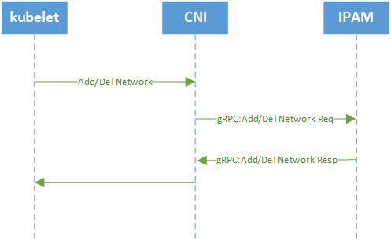

# IP Address Manager(IPAM)

当kubelet创建Pod时，会调用CNI插件为Pod初始化网络功能。CNI插件会为Pod分配一个IP地址，并做其他相应的配置。为了加快CNI插件的IP分配速度，我们在每个Node节点上运行一个IPAM插件，用来提前申请好IP并维护一个可用IP地址池。这样CNI插件便可以立即得到可用IP地址，无需等待。

## IP地址池

IPAM维护一个可用IP地址池，并会周期性的检查IP地址池中的可用IP数量。当数量过低时，会申请新的弹性网卡，并从该网卡上申请从IP添加到地址池中；当数量过高时，会选择一部分从IP进行释放。当某块弹性网卡上的从IP都被释放掉后，该弹性网卡也被释放掉。

### 维护IP地址池

当一个node节点刚刚加入到k8s集群中时，IPAM仅添加一块弹性网卡到虚机。随着不断在该虚机上创建Pod，可用IP地址数量会逐渐减少。

当地址池中的IP地址数量下降到最小阈值时，IPAM执行一次扩容：

- 如果存在弹性网卡还可以继续申请从IP，则在该弹性网卡上申请从IP
- 如果所有弹性网卡都已被完全申请或没有可用的弹性网卡，则创建并挂载新的弹性网卡
- 从新申请的弹性网卡上申请从IP

当地址池中的IP地址数量上升到最大阈值时，IPAM执行一次缩减容量：

- 选择正在被使用的从IP数量最少的弹性网卡进行释放IP
- 释放完成后，检查是否存在弹性网卡，其从IP数量为0，此网卡被释放

相关数值：

- IP池每次扩容/缩减数量(StepSize): 20个
- 最小阈值：StepSize / 4 即5个
- 最大阈值：2 * StepSize - 最小阈值，即35个

如此设置可防止可用从IP数量在特定的范围波动时，频繁申请释放弹性网卡。  

### 重建IP地址池

IPAM在重启时需要重建地址池，重建方法如下。

通过metadata服务查询node上所挂载的弹性网卡:

```plain
# curl http://169.254.169.254/jcs-metadata/latest/network/
```

注：network/1/为主网卡，弹性网卡是id为2以上的网卡。

通过[jdcloud-sdk-go](https://github.com/jdcloud-api/jdcloud-sdk-go)提供的接口，查看每个弹性网卡上已分配的IP地址。

通过查询kubelet提供的接口，查询当前node上已有的pod和正在使用的IP：

```plain
# curl http://localhost:10255/pods
```

根据以上信息，IPAM可以重建IP地址池。

## 子网和安全组

所有的node节点上的所有的弹性网卡和IP，都会从同一个子网内分配，使用相同的安全组配置。子网和安全组信息需要手动写入到配置文件中。

## 规格说明

每个虚机上的弹性网卡数量限制和虚机的规格有关系，请参考[使用限制](https://docs.jdcloud.com/cn/elastic-network-interface/restrictions)。

## 与CNI交互

IPAM与CNI通过gRPC接口通信。



## 安装和运行

IPAM以daemonset方式，运行在所有的node节点上。

## DEBUG接口

可以使用ipam提供的接口，查询当前IP地址池的状态：

```plain
- curl http://127.0.0.1:51678/v1/pods
- curl http://127.0.0.1:51678/v1/enis
```
